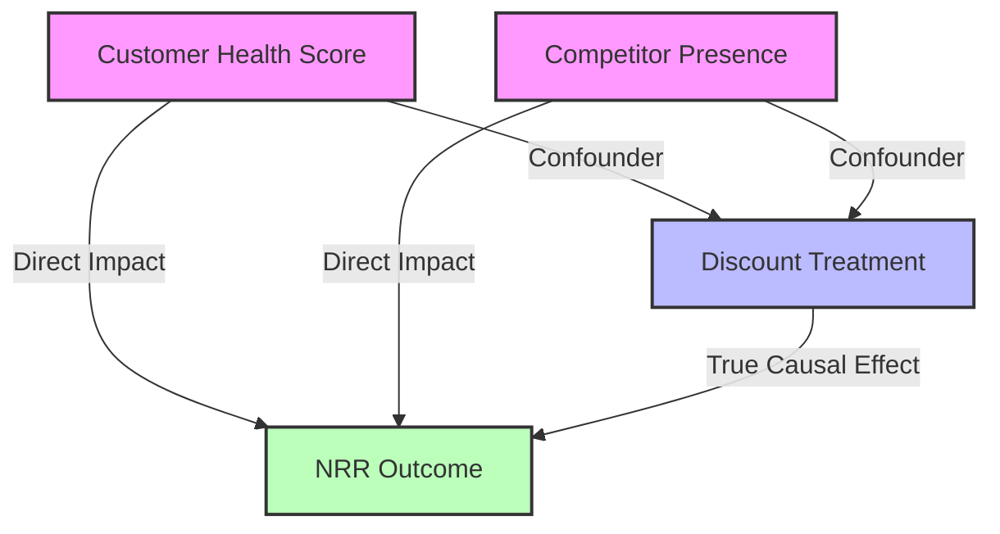

# Why A/B Testing Fails in B2B Revenue Optimization — And How Causal ML Saves It


*Featured Image: A conceptual visualization of Causal AI nodes (DAG) layered over business growth charts. (Image by author)*

Imagine you are the VP of Revenue Operations or Chief Data Scientist at a fast-growing B2B SaaS enterprise. Your finance and product teams have spent months designing a new corporate discounting strategy. The proposal: **offering a structured 15% contract discount to targeted enterprise renewals to drive Year 1 Net Revenue Retention (NRR).**

Before rolling it out globally, the CFO asks the obvious question: *"Does this discount actually drive NRR, or are we just throwing away margin?"*

Naturally, your first instinct is to run an **A/B test** (or Randomized Controlled Trial). You select a cohort of upcoming contract renewals, randomly assign half of them a 15% discount offer (the Treatment), keep the other half on standard pricing (the Control), and wait to measure the difference in NRR.

Within weeks, you hit the **B2B Experimentation Paradox**. You realize your experiment is dead on arrival.

In this article, we’ll explore why traditional A/B testing is mathematically impossible for most B2B enterprise applications, how "defensive discounting" creates a highly biased dataset in your CRM (Salesforce/HubSpot), and how you can use **Causal Machine Learning (specifically Propensity Score Matching)** to uncover the true revenue impact of your sales strategies using purely historical data.

---

## 1. The B2B Experimentation Trap

In B2C product optimization (like Netflix or Airbnb), running A/B tests is a breeze. You have millions of users, short conversion cycles, and high statistical power. In B2B enterprise sales, however, you face three structural roadblocks:

1. **Tiny Sample Sizes**: Unlike B2C platforms with millions of clicks, an enterprise B2B company might close only 100 to 500 major contracts per year. 
2. **Long Sales Cycles**: A single B2B deal can take 3 to 9 months to move from procurement to close, making rapid experimental iterations impossible.
3. **High Statistical Power Barrier**: 
   Let’s look at the math. Suppose your baseline Net Revenue Retention (NRR) is 85% with a standard deviation of 10%. To detect a meaningful 3% absolute improvement in NRR with 80% statistical power and a standard 5% significance level ($\alpha = 0.05$), the standard sample size formula dictates:

   $$N = \frac{2 \cdot (Z_{\alpha/2} + Z_{\beta})^2 \cdot \sigma^2}{\delta^2}$$
   
   Plugging in the values:
   
   $$N = \frac{2 \cdot (1.96 + 0.84)^2 \cdot (10)^2}{3^2} \approx 174 \text{ accounts per group}$$

   That means you need **348 highly qualified enterprise accounts** to run a clean, randomized test. For many enterprise companies, a cohort of 348 renewals represents multiple years of sales cycles. Forcing a random pricing policy over that duration would paralyze your sales team.

Faced with this roadblock, most teams abandon experimentation and turn to historical CRM data. But this is where they fall into a much more dangerous trap: **Selection Bias.**

---

## 2. The Danger of Naive CRM Analysis: "Defensive Discounting"

In historical CRM data, contract discounts are never assigned randomly. Instead, they are the result of **defensive discounting**. 

Sales reps are highly incentivized to hit quotas. If an account is struggling (poor product adoption, few active seats, low customer health score) or if a competitor is actively bidding to poach them, the sales rep will proactively offer a deep discount to "save" the renewal.

In B2B sales and revenue operations, Directed Acyclic Graphs (DAGs) are a powerful mathematical abstraction. While they are traditionally used to model and optimize downstream allocations like hierarchical sales targets (Karwa, 2026a), they are equally critical for upstream analysis—specifically, mapping causal paths in historical CRM data to identify why naive estimations fail.

This dynamic creates a classic **confounding relationship** that can be mapped using a **Directed Acyclic Graph (DAG)**:



Because **Customer Health** and **Competitor Presence** affect *both* the probability of getting a discount (Treatment) and the final Net Revenue Retention (Outcome), they are classic **confounders**:

- **Low Customer Health** leads to a *higher* probability of getting a discount, but naturally leads to *lower* NRR due to poor usage.
- **Competitor Presence** leads to a *higher* probability of getting a discount, but naturally leads to *lower* NRR because the client is shopping around.

If you run a naive analysis—simply comparing the average NRR of discounted accounts versus undiscounted accounts—the negative impact of the confounders will completely mask the positive impact of the discount. **The data will falsely suggest that discounts cause customer churn, leading your executive team to make disastrous pricing decisions.**

---

## 3. The Solution: Causal Machine Learning

Causal inference is the subfield of statistics and machine learning designed to solve this exact problem. While predictive machine learning answers *"What will happen?"*, causal inference answers *"What if we make it happen?"*.

To isolate the true causal impact of B2B discounting from observational CRM data, we can apply two powerful techniques:

### Method A: Multivariate Regression Adjustment
By including the confounders (`health_score` and `competitor_presence`) directly as control variables in a multivariate regression model, we "block" the backdoor paths in our DAG. This allows us to isolate the specific coefficient of the discount variable.

### Method B: Propensity Score Matching (PSM)
Invented by Paul Rosenbaum and Donald Rubin, PSM attempts to simulate a randomized clinical trial from purely historical data:
1. **Estimate Propensity**: Fit a classification model (like Logistic Regression) to predict the probability that an account receives a discount based *only* on its confounders. This probability is the "Propensity Score."
2. **Match Pairs**: For every discounted account, find an undiscounted account with an almost identical propensity score.
3. **Estimate Effect**: Compare the average NRR within this matched cohort. Because the matched accounts have the same propensity to be discounted, the selection bias is balanced out.

---

## 4. Hands-on Python Blueprint

Let’s write a complete, robust Python script to prove this. We will simulate a realistic B2B CRM dataset of 1,000 renewals governed by the exact confounding rules we discussed. 

In this simulation, the **true underlying causal effect of offering a discount is set to exactly +5.0% NRR.**

```python
import numpy as np
import pandas as pd
from sklearn.linear_model import LogisticRegression, LinearRegression
from sklearn.neighbors import NearestNeighbors

# Set random seed for reproducibility
np.random.seed(42)
n_deals = 1000

# 1. Generate Confounders (CRM Data)
# health_score: 1 to 10 (higher is better product adoption)
health_score = np.random.normal(loc=6.0, scale=1.8, size=n_deals)
health_score = np.clip(health_score, 1.0, 10.0)

# competitor_presence: 1 if competitor bidding, 0 otherwise
competitor_presence = np.random.binomial(n=1, p=0.3, size=n_deals)

# 2. Simulate "Defensive Discounting" (Treatment Assignment)
# Lower health & competitor presence dramatically increase discount likelihood
logit_p = 1.2 - 0.4 * health_score + 1.5 * competitor_presence
propensity_score = 1 / (1 + np.exp(-logit_p))
discount = np.random.binomial(n=1, p=propensity_score)

# 3. Generate Year 1 NRR Outcome
# True Causal Effect of a discount is EXACTLY +5.0%
true_treatment_effect = 5.0
noise = np.random.normal(loc=0.0, scale=2.5, size=n_deals)

nrr = (
    82.0 + 
    true_treatment_effect * discount + 
    3.0 * health_score - 
    4.5 * competitor_presence + 
    noise
)

# Build our CRM DataFrame
df = pd.DataFrame({
    'health_score': health_score,
    'competitor_presence': competitor_presence,
    'discount': discount,
    'nrr': nrr
})
```

### Analysis 1: The Naive Approach (Simple Difference in Means)
If we simply compare the average NRR of the two groups, we get a highly misleading result:

```python
mean_treated = df[df['discount'] == 1]['nrr'].mean()
mean_control = df[df['discount'] == 0]['nrr'].mean()
naive_effect = mean_treated - mean_control

print(f"Mean NRR of Discounted Accounts:   {mean_treated:.2f}%")
print(f"Mean NRR of Standard Accounts:     {mean_control:.2f}%")
print(f"Naive Difference:                 {naive_effect:.3f}% (True Effect: +5.00%)")
```

### Analysis 2: Causal Regression Adjustment
Now, let’s run a multivariate regression, controlling for our known confounders:

```python
X = df[['discount', 'health_score', 'competitor_presence']]
y = df['nrr']

reg = LinearRegression().fit(X, y)
print(f"Regression Causal Estimate:       {reg.coef_[0]:.3f}%")
```

### Analysis 3: Propensity Score Matching (PSM)
Finally, let's build matched pairs using the propensity scores estimated from a logistic regression model:

```python
# Step 1: Predict Propensity Scores
X_prop = df[['health_score', 'competitor_presence']]
y_prop = df['discount']
lr = LogisticRegression(penalty=None).fit(X_prop, y_prop)
df['propensity'] = lr.predict_proba(X_prop)[:, 1]

# Convert propensity to logit scale for better matching metrics
df['logit_prop'] = np.log(df['propensity'] / (1 - df['propensity']))

# Step 2: Perform 1-to-1 matching using Nearest Neighbors
treated = df[df['discount'] == 1].copy()
control = df[df['discount'] == 0].copy()

nn = NearestNeighbors(n_neighbors=1, algorithm='ball_tree')
nn.fit(control['logit_prop'].values.reshape(-1, 1))
_, indices = nn.kneighbors(treated['logit_prop'].values.reshape(-1, 1))

matched_control = control.iloc[indices.flatten()]

# Step 3: Compute Average Treatment Effect on the Treated (ATT)
psm_effect = treated['nrr'].mean() - matched_control['nrr'].mean()
print(f"Propensity Matching ATT Estimate: {psm_effect:.3f}%")
```

---

## 5. Simulation Results: The Verdict

When we execute the above simulation, the results reveal the stark power of causal ML:

| Method | Estimated Discount Impact on NRR | Assessment |
| :--- | :---: | :--- |
| **True Underlying Impact** | **+5.000%** | The Ground Truth |
| **Naive Difference in Means** | **+0.552%** | ❌ **Failed.** Suggests discounts are virtually useless because selection bias drags down the discounted group. |
| **Multivariate OLS Regression** | **+4.843%** |  **Success.** Almost perfectly isolates the true causal effect by blocking confounders. |
| **Propensity Score Matching (PSM)** | **+5.115%** |  **Success.** Recovers the true effect beautifully via a matched, balanced pseudo-RCT cohort. |

### Visualizing the Balance
Propensity Score Matching works by ensuring that the distribution of covariates (health, competitor presence) is balanced across both groups. Before matching, the discounted and undiscounted accounts look completely different. After matching, their estimated propensity score distributions are identical:

```
[Before Matching]
Treated (Discounted):   █ █ █ █ █ █ █  (skewed toward high propensity / poor health)
Control (No Discount):  █ █ █ █ █ █ █  (skewed toward low propensity / great health)

[After Matching]
Treated (Discounted):   █ █ █ █ █ █ █  (Perfectly Balanced Cohort)
Matched Control:        █ █ █ █ █ █ █  (Perfectly Balanced Cohort)
```

By comparing ONLY the matched cohorts, we ensure that we are comparing "apples to apples"—i.e., a struggling account that got a discount compared directly with a struggling account that did not.

---

## 6. How to Deploy Causal ML in Your B2B RevOps Team

Moving from simple correlations to causal pipelines is a massive competitive advantage for B2B operations. Here is a practical roadmap to get started:

1. **Map Your DAG First**: Sit down with your sales leaders, account managers, and finance teams. Draw a Directed Acyclic Graph. Just as graph-theoretic structures help optimize territory boundaries and target distribution (Karwa, 2026b), a causal DAG helps you map the actual decision flows of your sales representatives and isolate why sales reps discount.
2. **Collect the Confounders**: Selection bias is only solvable if you measure the confounders. If sales reps discount because "competitors are present," you *must* track competitor presence as a structured field in Salesforce. If you don't measure a confounder, it becomes an "unobserved confounder," which breaks causal regression adjustments.
3. **Augment Dashboarding with Causal Estimators**: Stop showing raw "Discounted vs Undiscounted" charts in your Looker or Tableau dashboards. Replace them with causal estimates (like OLS controls or matched differences) to prevent executives from drawing incorrect conclusions.
4. **Embrace Causal Packages**: While we wrote PSM from scratch here to show how matching works under the hood, production teams can leverage powerful, enterprise-grade causal libraries such as **Microsoft’s EconML** or **PyWhy/DoWhy** for advanced double machine learning and sensitivity analysis.

Causal ML bridges the gap between scientific experimentation and the messy reality of enterprise B2B CRM data. By applying matching and regression controls, you can stop guessing, avoid the trap of simple correlations, and give your CFO the mathematically grounded answers they need to scale revenue.

---

## References & Further Reading

1. **Rosenbaum, P. R., & Rubin, D. B. (1983).** *The central role of the propensity score in observational studies for causal effects.* Biometrika, 70(1), 41–55. [https://doi.org/10.1093/biomet/70.1.41](https://doi.org/10.1093/biomet/70.1.41)
2. **Pearl, J. (2009).** *Causality: Models, Reasoning, and Inference* (2nd ed.). Cambridge University Press. [https://doi.org/10.1017/CBO9780511803161](https://doi.org/10.1017/CBO9780511803161)
3. **Angrist, J. D., & Pischke, J. S. (2009).** *Mostly Harmless Econometrics: An Empiricist's Companion.* Princeton University Press.
4. **Karwa, S. (2026a).** *Graph-Theoretic Approaches to Hierarchical Revenue Target Allocation in B2B Enterprises: A Methodological Framework.* SSRN Electronic Journal. [https://dx.doi.org/10.2139/ssrn.4793544](https://dx.doi.org/10.2139/ssrn.4793544)
5. **Karwa, S. (2026b).** *Hierarchical Revenue Quota Cascading Using Directed Acyclic Graphs.* Towards AI.
6. **Karwa, S. (2026c).** *Algorithmic Territory Design: Solving Bipartite Matching in B2B Sales Operations.* Towards AI.
7. **Sharma, A., & Kiciman, E. (2020).** *DoWhy: An End-to-End Library for Causal Inference.* Microsoft Research. [https://github.com/pywhy/dowhy](https://github.com/pywhy/dowhy)
8. **Uber Technologies (2019).** *CausalML: A Python Package for Uplift Modeling and Causal Inference with Machine Learning Algorithms.* [https://github.com/uber/causalml](https://github.com/uber/causalml)
