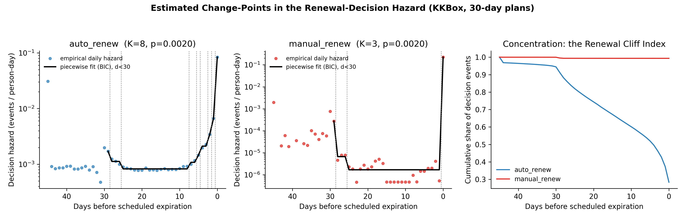
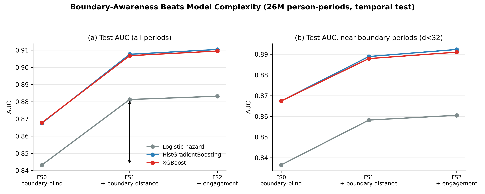
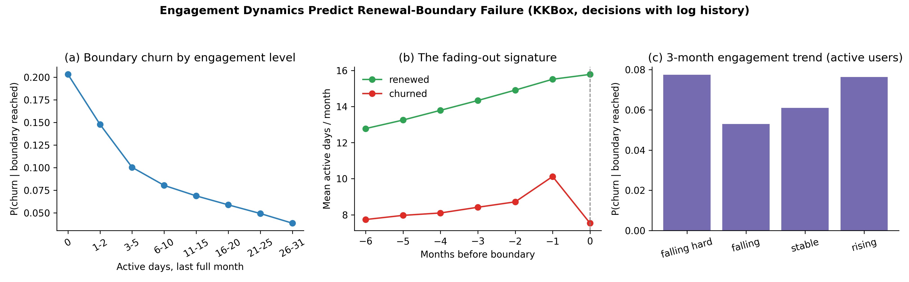
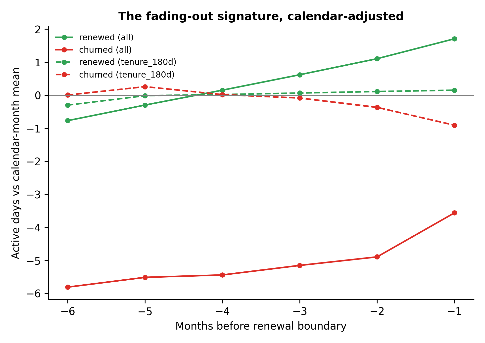
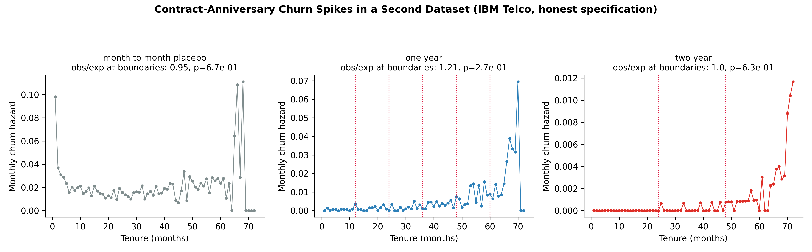

# The Renewal Cliff: Change-Point Hazards and Boundary-Aware Churn Prediction in Subscription Markets

**Shreyas Karwa**
Independent researcher, San Francisco, CA
shreyasrkarwa@gmail.com

*This research was conducted independently. All data are public; all code is available at [REPO URL upon publication]. Draft — not for circulation.*

---

## Abstract

Subscription businesses lose most of their customers not gradually but at contract renewal boundaries — the scheduled dates on which a subscription either renews or ends. Practitioners call this the "renewal cliff," yet the academic churn-modeling literature has neither formalized nor measured it. Using 23.0 million transactions covering 2.43 million subscribers of a large music-streaming service, we reconstruct 20.8 million individual renewal decisions and characterize the cliff directly. Because a subscription that is not renewed *must* end on its expiration date — making "churn at expiry" partly true by definition — we introduce a cleaner measurement target: the *decision hazard in boundary-relative time*, the day-by-day probability that a subscriber takes a churn-relevant action (actively cancelling, or letting a renewal date pass unpaid), organized by how far away the next renewal date is. A statistical model that allows the hazard to jump at estimated break points, tested against the alternative that risk changes only smoothly, rejects smoothness overwhelmingly (bootstrap p ≈ 0.002): for auto-renewing subscribers, daily decision risk is flat and low through most of the billing cycle (≈8 in 10,000), begins climbing eight days before expiration, and jumps roughly a hundredfold on the expiration day itself. A single summary number, the Renewal Cliff Index — the share of all churn decisions occurring within a chosen window of a renewal date — separates subscription designs cleanly: 31% of auto-renewers' decisions but 99.8% of manual renewers' decisions happen on the renewal day itself. For prediction, simply telling a model how many days remain until each customer's renewal date improves out-of-sample accuracy by more than upgrading from simple logistic regression to modern gradient-boosted machine learning (+0.038–0.040 vs. +0.024–0.026 AUC on a 26-million observation panel), and the two improvements stack. Usage data identifies *who* will cancel mid-cycle; the renewal calendar determines *when* everyone else churns. A second dataset whose contracts renew silently, with no payment re-authorization, shows no cliff at all — supporting a simple design principle: cliffs arise where boundaries force decisions. We discuss implications for retention targeting, contract design, and subscription revenue modeling.

**Keywords:** customer churn; survival analysis; change-point detection; subscription commerce; renewal; dynamic prediction

---

## 1. Introduction

The subscription has become the dominant commercial form for software, media, and a growing range of consumer services. Its defining institutional feature is the *renewal boundary*: a contractually scheduled moment — the day a monthly plan expires, the anniversary of an annual contract — at which the relationship either continues or ends. Practitioners organize entire retention operations around these dates: renewal forecasts, "save desks" staffed to catch cancelling customers, win-back campaigns timed to expirations. Industry lore speaks of a "renewal cliff," the pattern in which accounts that looked perfectly healthy terminate abruptly on a renewal date.

Academic churn modeling, by contrast, has largely treated customer defection as a smooth process. The standard tools — survival regressions, parametric duration models, and more recently flexible machine-learning classifiers — assume, implicitly or explicitly, that a customer's risk of leaving drifts gradually with time and circumstances. The renewal calendar, the very institution that generates most of the events these models try to predict, is usually absorbed into a generic "customer age" variable or omitted entirely.

This paper puts the boundary at the center of the analysis, and asks three questions in ordinary language. First, *what does churn risk actually look like as a renewal date approaches?* Is the cliff a genuine discontinuity — a sudden jump in risk — or just a steep but smooth slope that ordinary models could capture with enough flexibility? Second, *how much does it help a prediction model to know where each customer stands in their renewal cycle*, compared with the gains from ever-fancier modeling machinery that dominate the churn-prediction literature? Third, *when do cliffs exist at all?* Are they a universal feature of subscriptions, or a consequence of specific contract designs?

Answering these questions requires data that most churn studies lack: complete payment histories with explicit expiration dates, at a scale large enough to measure risk day by day near renewal boundaries. We use the public KKBox dataset, released for the WSDM Cup 2018 machine-learning competition: 23.0 million subscription transactions from 2.43 million subscribers of a major Asian music-streaming service across 27 months, plus 410 million days of listening logs. Every transaction records a scheduled membership-expiration date, whether the plan auto-renews, and whether the transaction was a cancellation. From this raw material we reconstruct 3.03 million *subscription spells* (continuous stretches of paid membership) and 20.8 million *renewal decisions* — every occasion on which a subscription reached, or ended at, a scheduled boundary. To our knowledge this is the largest boundary-resolved analysis of subscription churn to date, and — unusually for this literature — every number in the paper can be reproduced from public data with the code we release.

**Our first contribution is careful measurement, starting with an honest definition of what can be measured.** In transaction data there is a subtle trap: a subscription that is not renewed ends on its expiration date *by definition*, so "customers churn at renewal dates" is partly a tautology. What is genuinely behavioral — what reflects choices people make — is the *timing of decisions*. A subscriber can actively cancel mid-cycle, at a moment of their choosing, or passively let a renewal date pass without paying. We therefore measure the *decision hazard in boundary-relative time*. A "hazard," in survival analysis, is simply the probability that an event happens today given that it has not happened yet; "boundary-relative time" means we index each day not by the calendar but by the number of days remaining until that subscriber's next scheduled expiration. Concretely: among all subscriber-days that fall, say, ten days before an expiration date, what fraction end in a cancellation or lapse? Computing this for every distance-to-boundary, over 521 million subscriber-days, yields a complete day-by-day risk profile of the renewal cycle — an estimand (a target of estimation) that is portable to any business with scheduled renewal dates and that does not confuse mechanical contract expiry with human behavior.

**Our second contribution is a formal statistical test of the cliff.** The core question — jump or slope? — is a question about discontinuities in the hazard. We model the daily decision hazard as *piecewise-constant*: risk is assumed flat within segments of the cycle but allowed to jump at *change-points*, whose number and locations we estimate from the data rather than assume. (A change-point model is the statistician's formalization of "something different starts happening at day X.") The best-fitting segmentation is found exactly by dynamic programming — an efficient search over all possible ways to divide the cycle. We then test this jumpy model against a *smooth null hypothesis*: the alternative view that risk changes gradually, represented by a flexible smooth curve (a spline) fit to the same data. One technical wrinkle matters and deserves plain statement: when testing "is there a jump at some unknown location?", the usual statistical yardsticks (chi-squared tables) are invalid, because under the smooth hypothesis the jump location doesn't exist as a parameter (Davies, 1987). We therefore calibrate the test by *parametric bootstrap*: we simulate many fake datasets from the fitted smooth model, ask how big the apparent "jump evidence" gets by pure chance, and compare. The answer is unambiguous. Chance produces test statistics in the tens; the data produce 53,256. For auto-renewing subscribers the fitted hazard is flat at about 8 in 10,000 per day through the middle of the billing cycle, kinks upward at estimated change-points 8, 6, 5, 3, 2, and 1 days before expiration, and jumps to about 8 in 100 — a hundredfold increase — on the expiration day itself. For manual renewers the picture is starker still: 99.8% of all decisions occur on the boundary day. The cliff is real, and it is a jump, not a slope.

To make the phenomenon comparable across companies, segments, and contract designs, we compress it into one number: the **Renewal Cliff Index**, RCI(w), defined as the share of all churn decisions that occur within w days of a renewal boundary. An RCI(0) of 0.31 (auto-renewers) means 31% of decisions land exactly on renewal days; an RCI(0) of 0.998 (manual renewers) describes a business whose churn is almost entirely a renewal-day event. The index requires nothing more than decision dates and scheduled expiration dates — data every billing system already contains.

**Our third contribution reframes the prediction problem.** The churn-prediction literature is, to a first approximation, a twenty-year horse race of increasingly sophisticated classifiers evaluated on feature sets that ignore the renewal calendar. We stage a different race. On a panel of 26 million customer-months with a strict temporal split (models trained on the past, evaluated on the future — the way they would actually be used), we compare three feature sets across three model classes. Adding boundary-distance features to a conventional churn feature set raises out-of-sample AUC by +0.038 to +0.040 *in every model class*. (AUC, or area under the ROC curve, is a standard accuracy measure: the probability that a model ranks a random churner as riskier than a random non-churner; 0.5 is coin-flipping, 1.0 is perfection.) Upgrading from logistic regression to gradient-boosted trees or XGBoost — the workhorse machine-learning improvements of the last decade — is worth +0.024 to +0.026. The institutional feature beats the algorithmic upgrade, and the two stack, reaching AUC 0.910. Stated plainly: *knowing where each customer stands in their renewal cycle is worth more than any amount of model sophistication applied without that knowledge.*

Usage data — the 410 million days of listening logs — adds a further, smaller improvement, and its role turns out to be structurally specific. Interaction models show that engagement telemetry discriminates best *mid-cycle*, where the only way to churn is to actively cancel; near the boundary, where passive lapsing dominates, even engaged subscribers fail to renew at material rates. This yields the paper's organizing empirical claim: **engagement predicts who actively cancels; the renewal calendar determines when everyone else churns.** An event study (a before-and-after comparison centered on each customer's renewal date, adjusted for the platform's overall growth) confirms that pre-churn disengagement is real but late and modest — about one fewer active day per month, appearing only in the final two months. Engagement *levels* carry most of the signal; recent *trends* add little.

**Finally, we ask when cliffs should exist at all.** If the cliff is generated by the institution — a date on which money must move for service to continue — then contract designs whose boundaries force nothing should show no cliff. The IBM Telco dataset (7,032 telecom customers on month-to-month, one-year, and two-year contracts) provides the test, because North American telecom contracts typically *auto-convert* to month-to-month at term end: the anniversary passes silently, service continues, no re-authorization occurs. We find no churn spike at contract anniversaries (observed churn at anniversary months is 1.21 times the neighboring-month expectation, p = 0.27; a placebo test on month-to-month customers gives 0.95), despite power to detect spikes larger than about 1.7×. The contrast supports a simple design principle with testable reach: **cliffs arise where boundaries force decisions.** Along the way we correct a widespread error in studies using this popular dataset — the inclusion of a covariate (TotalCharges) that mechanically encodes the outcome, inflating reported accuracy from an honest 0.879 to an illusory ≈0.90.

The paper proceeds as follows. Section 2 situates the contribution in four literatures. Section 3 describes the data and the construction and validation of spells and renewal decisions. Section 4 presents the descriptive anatomy of the cliff. Section 5 develops the change-point model and its inference. Section 6 studies prediction. Section 7 presents the Telco contrast and the design theory. Section 8 draws managerial implications, and Section 9 concludes.

## 2. Related literature

**Churn prediction.** A large applied literature treats churn as a supervised classification problem: given a snapshot of customer characteristics, predict who will leave. Landmark comparative studies — the churn "tournament" of Neslin, Gupta, Kamakura, Lu, and Mason (2006), the bagging-and-boosting comparisons of Lemmens and Croux (2006) — established a pattern that has held through the deep-learning era: better algorithms yield modest, real gains on a fixed feature set. Our results locate a larger margin elsewhere, in a feature the institutional setting supplies for free but which standard feature sets omit. The targeting-oriented strand (Ascarza, 2018) shows that ranking customers by churn probability is not the same as ranking them by how much an intervention would help; our decomposition of churn into two distinct processes — mid-cycle cancellation versus boundary lapse — sharpens that point, since the two processes plausibly respond to different interventions delivered at different times.

**Survival analysis of customer relationships.** Duration models have long been applied to retention. In *contractual* settings — where a formal agreement defines the relationship — proportional-hazards regressions on tenure are standard, and an elegant parametric tradition models retention as a sequence of coin-flip renewal decisions (the shifted-beta-geometric model of Fader and Hardie, 2007). That tradition is closest in spirit to ours, but it abstracts away *within-cycle timing* entirely: a period is renewed or not, and nothing happens in between. Our decision-hazard estimand nests both views. The spike of probability mass on the boundary day corresponds to the renewal coin-flip; the mid-cycle component captures actively timed cancellations that the renewal-decision abstraction throws away — and which, we show, are precisely the component that usage data can predict. Modern machine-learning survival models — random survival forests (Ishwaran et al., 2008), DeepSurv (Katzman et al., 2018), DeepHit (Lee et al., 2018), Cox-Time (Kvamme et al., 2019) — have even been benchmarked on this same KKBox dataset, but always as boundary-blind learners of smooth hazards; none models the calendar structure that, as Section 5 shows, dominates the data-generating process.

**Change-point hazard models.** The statistics literature has studied hazards with structural breaks since at least Matthews and Farewell (1982), who tested a constant hazard against a single break at an unknown time, and it has long been understood that such tests require nonstandard inference because the break location is a "nuisance parameter absent under the null" (Davies, 1987) — the technical phrase for the problem described in the Introduction. We bring this machinery to a new domain and, more importantly, to a new time axis: boundary-relative time rather than calendar time or customer age. On this axis the breaks are generated by institutions — billing systems, reminder emails, grace periods — rather than by biology or physics, and sample sizes in the hundreds of millions of person-days make their estimated locations sharp.

**Defaults and deadlines.** That auto-renewing subscribers churn at 4.9% per boundary while manual renewers churn at 33.0%, and that cancellation activity accelerates only in the final week before a deadline, will be unsurprising to readers of the behavioral literature on defaults, deadlines, and procrastination. We emphasize what this paper does and does not claim: subscribers *choose* their renewal settings, so the auto-renew differential mixes selection (different kinds of people choose auto-renew) with treatment (auto-renew itself changes behavior), and we make no attempt to separate the two. Our contribution is to measure, at scale and in fine temporal detail, the timing structure that any behavioral account must explain.

## 3. Data and the construction of renewal decisions

### 3.1 Setting and raw data

KKBox is a subscription music-streaming service. Its dataset, released publicly for the WSDM Cup 2018 churn-prediction challenge, spans January 2015 through March 2017 and has three components. First, 23.0 million *transactions*: each row records the payment method, the plan length in days, the list price, the amount actually paid, whether the plan is set to auto-renew, the transaction date, the scheduled membership-expiration date, and whether the transaction is a cancellation. Second, *member demographics* — city, age, gender, registration channel — available for 82% of transacting users (age and gender are unreliable or missing for the majority, as is well known for this dataset, and are treated with missingness indicators throughout). Third, 410.5 million rows of *daily listening logs* — how many songs a user played each day, how many they played to completion versus skipped early, unique songs, and total listening seconds — which we aggregate into user-month summaries. Plans of 25–35 days (essentially, monthly plans) account for 86% of renewal decisions; 7-day plans and 90-to-450-day plans make up the remainder and are analyzed separately where relevant.

### 3.2 From transactions to spells: the churn rule

Raw transactions do not directly say when a subscription ended; that must be reconstructed. We sort each user's transactions by date and track their *effective expiration date* — the date through which they have paid. Ordinary renewals push this date forward; cancellation transactions pull it backward (contractually, cancelling typically ends coverage at an earlier date). The reconstruction rule, which follows the competition's official churn definition, is then: **a subscription spell ends in churn when more than 30 days pass after the effective expiration without any new transaction.** If the user transacts again after such a gap, a new spell begins. Spells whose expiration falls within 30 days of the end of the data (March 31, 2017) are *censored* — a survival-analysis term meaning we cannot yet know their outcome, because the window in which they might have renewed extends beyond our data; censored spells are retained but never counted as churned or renewed.

This procedure yields 3.03 million spells from 2.43 million users (Table 1). 59.5% of spells end in observed churn; the median spell lasts 4.2 months.

**Table 1. Dataset construction summary.**

| Quantity | Value |
|---|---|
| Raw transactions (after deduplication) | 22,965,404 |
| Subscribers | 2,426,143 |
| Subscription spells | 3,033,232 |
| Spells ending in observed churn | 59.5% |
| Median spell length | 4.2 months |
| Spells with left-truncation flag | 18.1% |
| Renewal decisions (decided / censored) | 19,533,451 / 1,227,290 |
| Person-periods in prediction panel | 25,981,024 |
| Daily listening-log rows aggregated | 410,502,905 |
| Users with any listening history | 79.9% |
| Demographics coverage | 82.0% | One subtlety: 18.1% of spells begin in the very first month of the data and may actually have started earlier (we see them mid-life). This is called *left truncation*, and such spells carry a flag so that robustness checks can exclude them or model their delayed entry explicitly.

Because our churn rule is reconstructed rather than handed to us, we validate it against the competition's official labels, which were generated by the organizer's own (published) labeling code. For the 859,865 users evaluable under the official labeling window, our derived labels agree in **98.77%** of cases. The disagreements are strikingly asymmetric — 10,398 cases where the official labeller says "churned" and we say "renewed," versus only 163 in the reverse direction — and trace to the official labeller's stricter treatment of certain cancellation sequences (a renewal must extend coverage beyond a previously cancelled expiration to count). Appendix A details the comparison. We read 98.8% agreement as confirmation that the reconstruction captures the intended churn concept, with the residual disagreement itself documenting a boundary case in how "renewal" should be defined.

### 3.3 The unit of analysis: renewal decisions

The cliff is a statement about what happens at boundaries, so our central unit of analysis is the *renewal decision*: one subscription cycle arriving at (or ending at) its scheduled expiration. Within a spell, each consecutive pair of transactions defines a renewal, whose *timing* we measure as the gap between the new transaction and the current expiration date. Renewals executed within a week before expiration or during the 30-day grace window afterward genuinely engage the boundary — this is when auto-renewal charges fire and when lapsed users return. Transactions executed much earlier are plan changes or top-ups, not renewal decisions, and are excluded. The final boundary of every spell is either a churn (if the outcome is observed) or censored.

This construction yields 20.76 million boundary events: 19.53 million decided (renewed or churned) and 1.23 million censored. Renewal timing is tightly concentrated, confirming that boundaries are where the action is: 81.7% of renewal transactions occur within ±3 days of the scheduled expiration, 19.6% occur during the grace window, and only 11.1% occur more than a week early.

Two conventions apply throughout. "Boundary churn rate" always means P(churn | boundary reached) — of the boundaries that arrived and were decided, what fraction ended the subscription. And all usage covariates are lagged to the last *complete* calendar month before the boundary month, so that a model never "predicts" churn using listening behavior recorded after the subscriber already decided to leave — a leakage discipline that, as Section 7 shows, this literature has not always maintained.

## 4. The anatomy of the renewal cliff

Figure 1 and Table 2 contain the headline numbers; five facts organize them.

**Figure 1.** The renewal cliff in 23 million subscription transactions. (a) Timing of renewal transactions relative to the scheduled expiration date — 81.7% occur within ±3 days. (b) P(churn | boundary reached) by the boundary's position within the spell. (c) The same probability by plan length. (d) Decomposition of churned boundaries into passive lapses versus active cancellations.

**Table 2. Boundary churn rates by segment.** P(churn | boundary reached), decided decisions only.

| Cut | Category | Churn rate | n (decisions) |
|---|---|---|---|
| All | — | 9.25% | 19,533,451 |
| Boundary no. | 1st | 33.26% | 2,865,992 |
| | 2nd | 20.30% | 1,807,036 |
| | 3rd | 6.05% | 1,369,636 |
| | 4th–6th | 3.92% | 3,433,862 |
| | 7th–12th | 2.98% | 4,966,806 |
| | 13th+ | 2.36% | 5,090,119 |
| Renewal mode | Auto-renew | 4.91% | — |
| | Manual | 32.98% | — |
| Plan length | ≤7 days | 44.08% | 1,349,971 |
| | 30 days | 6.31% | 17,886,527 |
| | 90 days | 17.61% | 19,737 |
| | 180 days | 27.48% | 182,581 |
| | 365+ days | 31.11% | 94,635 |

**The cliff exists and is enormous.** Across all decided boundaries, the churn probability is 9.25%. Against this stands a mid-cycle background hazard close to zero: in the customer-month panel, the probability of churning within 30 days is 0.0002 when the next boundary is more than three months away, 0.025 when it is one to three months away, and 0.14 in the month containing the boundary. That is a risk gradient of nearly three orders of magnitude driven by nothing but position in the renewal calendar. Any model that represents churn risk as a smooth function of customer age is averaging over this gradient.

**Experience flattens the cliff.** A spell's *first* boundary fails 33.3% of the time. The second fails 20.3% of the time; the third, 6.1%; the fourth through sixth, 3.9%; and beyond the twelfth, 2.4%. Each survived renewal roughly halves the risk of the next until the curve flattens near 2–3%. Two mechanisms could produce this — habit formation within customers, or sorting (each boundary filters out the customers most likely to leave, so survivors are increasingly committed types) — and billing data alone cannot separate them. Either way, the practical implication stands: retention risk is overwhelmingly front-loaded into the first two or three renewals, and cohort economics computed with a constant retention rate are badly misspecified.

**The decision mechanism dominates everything else.** Auto-renewing subscribers churn at 4.9% per boundary; manual renewers at 33.0%. This 6.7-fold differential is larger than every demographic and usage gradient in the data. We stress again that it mixes selection and treatment. But its sheer size, alongside the near-degenerate timing distribution of manual renewers (Section 5), makes the renewal mechanism the first-order fact about subscription churn — ahead of who the customer is or how much they use the product. Notably, auto-renewal is no immunity: 44.9% of all churned boundaries belonged to auto-renewers.

**Longer contracts trade cliff frequency for cliff height.** Per-boundary churn is 6.3% on monthly plans, 27.5% on 180-day plans, and 31.1% on annual plans. (Seven-day plans churn at 44.1% per boundary but represent a trial-like population.) An annual contract does not remove renewal risk; it stores twelve months of it in one tall, rare cliff — the consumer-scale version of the enterprise-software renewal event that motivated this research program.

**Churn is two different processes.** Among churned boundaries, 70.1% are *passive lapses*: the final transaction on record is an ordinary renewal or purchase, after which the subscriber simply lets the next boundary pass. The remaining 29.9% are *active cancellations*: the final transaction is a cancellation, executed before expiration at a moment the subscriber chose. A binary churn label treats these identically; they are not. They differ in timing (Section 5), in predictability from usage data (Section 6), and presumably in what interventions could avert them (Section 8).

## 5. A change-point model of the decision hazard

### 5.1 Why "decision hazard," precisely

We want to test whether churn risk *jumps* at the boundary. But there is a measurement trap to avoid first. In transaction data, an unrenewed subscription terminates on its expiration date by definition — so if we naively plotted "terminations by day," we would manufacture a spike at the boundary out of pure bookkeeping. The behavioral content lies in *when people act*. A subscriber who cancels on day 17 of a 30-day cycle made a choice on day 17. A subscriber who lets the expiration pass unpaid made a choice (or a revealing non-choice) on the expiration day. Both are *decision events* with meaningful timing; the subsequent mechanical termination is not.

Accordingly, for each segment s (auto-renew versus manual, monthly plans), we define the decision hazard h_s(d): among all subscriber-days at distance d from the next scheduled expiration, the fraction on which a decision event occurs — either an active cancellation transaction or (at d = 0 only, by its nature) a passive lapse. The denominator, *exposure*, counts exact person-days: each subscription cycle contributes one day of exposure at each distance it traverses, and censored spells contribute exposure only through the end of the data. The monthly-plan population provides 457.5 million person-days and 822,714 decision events for auto-renewers, and 63.2 million person-days and 382,981 events for manual renewers. We fit on d ∈ {0, …, 29} — exactly one cycle — because days 30 and beyond mix in grace-period renewers, a different population on a different clock.

### 5.2 The model, in plain terms and in full

The scientific question is "jump or slope?", so we fit both and let them compete.

*The jumpy model.* We assume the hazard is constant within segments of the cycle but may jump at K unknown change-points: h(d) = λ₁ for the first stretch of days, λ₂ for the next, and so on. Crucially, we do not choose where the jumps go — for every candidate K we find the segmentation that maximizes the Poisson likelihood (the standard probability model for event counts) *exactly*, by dynamic programming: an efficient recursive search that provably finds the best of all possible ways to cut 30 days into K + 1 segments. The number of segments itself is chosen by the Bayesian information criterion (BIC), which rewards fit but charges a penalty for every added parameter, guarding against overfitting.

*The smooth model.* The null hypothesis is not "nothing happens near the boundary" — that would be a straw man — but "risk changes *smoothly*": the logarithm of the hazard is a cubic spline in d, a flexible curve that can rise steeply near the boundary but cannot jump.

*The test, and why it needs care.* The natural test statistic is the likelihood ratio: how much better does the jumpy model explain the data than the smooth one? But textbook distribution theory for likelihood ratios does not apply here, because under the smooth hypothesis the jump *locations* do not exist as parameters — a classic nonstandard situation (Davies, 1987) in which naive chi-squared p-values can be wildly anticonservative (that is, they would declare significance far too easily). The remedy is a *parametric bootstrap*: simulate 500 synthetic datasets from the fitted smooth model — worlds where smoothness is true — refit both models to each, and record how large the likelihood-ratio statistic gets by chance alone. The observed statistic is then compared against this simulated null distribution. This procedure directly answers the question a skeptical reader should ask: "couldn't a flexible-enough smooth curve, plus luck, produce your jumps?"

### 5.3 Results: the cliff is a jump, not a slope

It could not. Across 500 smooth-world simulations, the largest chance value of the test statistic is in the tens. The data produce **53,256** for auto-renewers and **312** for manual renewers — bootstrap p ≈ 0.002 in both cases, the smallest value resolvable with 500 replicates (Figure 2).

**Figure 2.** The daily decision hazard in boundary-relative time (log scale), 30-day plans. Dots: empirical hazard (events per person-day at each distance from expiration). Black line: piecewise-constant fit with change-points estimated by dynamic programming; dotted verticals mark estimated change-points. Left: auto-renewing subscribers (flat mid-cycle at 8×10⁻⁴, escalation from d=8, 105× spike at d=0). Center: manual renewers (near-point-mass at the boundary). Right: cumulative concentration of decision events — the Renewal Cliff Index read as a curve.

The fitted hazard for **auto-renewers** reads like an institutional timetable. Through the long middle of the cycle the daily decision hazard is flat at 8.0×10⁻⁴ — about one cancellation per 1,250 subscriber-days. Estimated change-points at 8, 6, 5, 3, 2, and 1 days before expiration mark an accelerating escalation — consistent with renewal-reminder notifications concentrating attention — and on the expiration day the hazard reaches 8.4×10⁻², a **105-fold** multiple of the mid-cycle rate. (BIC selects the maximum number of segments we allowed, K = 8. This is itself informative: with half a billion person-days, the near-boundary escalation is resolved so finely that a piecewise-constant family keeps subdividing it. The discontinuity conclusion is unaffected — the bootstrap rejects smoothness for any K ≥ 2 — but the final parametric shape of the escalation, e.g., a spike plus exponential ramp, is a refinement we flag for the final specification.) For **manual renewers**, the fitted model needs only K = 3: the hazard is ~10⁻⁵ mid-cycle and 2.2×10⁻¹ on the boundary day — a four-order-of-magnitude point mass. Where auto-renewal outsources the renewal decision to the billing system, the manual renewer *is* the billing system, and their behavior collapses onto the deadline.

Both segments also show change-points at d = 26–29 — the *start* of the cycle. These capture renew-then-immediately-cancel behavior: subscribers who allow a renewal to fire (or execute one) and then cancel within days, a pattern visible only on the boundary-relative clock and invisible to calendar-time analysis.

**The Renewal Cliff Index.** To compare cliff geometry across segments, firms, or contract designs, define RCI(w) = the share of decision events occurring within w days of a boundary. Auto-renewers: RCI(0) = 0.311, RCI(3) = 0.508, RCI(7) = 0.609, RCI(14) = 0.721. Manual renewers: RCI(0) = 0.998. One number now expresses what Figures 7 and 9 show in detail — and because it needs only decision dates and scheduled expirations, any subscription business can compute it from billing records alone. We propose it as a standard descriptive statistic for recurring-revenue businesses, on par with the churn rate itself: two firms with identical churn rates but RCIs of 0.3 and 0.99 face entirely different retention problems, require different models, and should time interventions entirely differently.

## 6. Prediction: boundary-awareness versus model complexity

### 6.1 Design

Does the cliff matter for the applied task the literature actually optimizes — predicting churn? We expand the spells into a panel of 26.0 million *person-periods* (one row per subscriber per 30-day interval of their spell, with a binary outcome: did the spell terminate in this interval?) and impose a strict *temporal split*: models are trained on the 15.2 million periods beginning before July 1, 2016 and evaluated on the 10.8 million periods after (test-set churn rate 5.5%). We emphasize the split choice because it is not cosmetic. Random splits — the norm in this literature — scatter each calendar month across both training and test sets, letting models exploit calendar information they would not have in deployment, and flattering every result. The temporal split also surfaces an honest difficulty that random splits hide: the platform's churn rate declined over time, so models calibrated on the past overpredict in the future — a *calibration drift* we report below rather than bury.

Three nested feature sets isolate the quantities of interest:

- **FS0 — boundary-blind.** What a conventional churn model uses: customer-age (tenure) bins, plan length, auto-renewal status, cumulative transaction count, and demographics (age, gender, registration channel, account age, with missingness indicators).
- **FS1 — + boundary distance.** FS0 plus days-until-next-expiration, entered as bins and a linear term. This is the paper's treatment variable, so to speak: one additional column of information that any billing system possesses.
- **FS2 — + engagement.** FS1 plus the listening telemetry, lagged to the last complete month: active days (this month and last), a three-month trend, listening hours, the share of songs skipped early, a zero-activity flag, and missingness indicators.

Each feature set is fit with three model classes spanning the complexity spectrum — logistic regression (the decades-old workhorse), histogram gradient boosting, and XGBoost (the modern default for tabular prediction) — and a final logistic specification (**FS3**) adds engagement × near-boundary interaction terms to ask *where in the cycle* engagement information earns its keep.

### 6.2 Results: the feature beats the algorithm

Out-of-sample AUC on the temporal test set (Table 3, Figure 3):

| | FS0 boundary-blind | FS1 + boundary | FS2 + engagement |
|---|---|---|---|
| Logistic regression | 0.8432 | 0.8813 | 0.8832 |
| Gradient boosting | 0.8675 | 0.9076 | 0.9104 |
| XGBoost | 0.8678 | 0.9068 | 0.9095 |

**Table 3.** Out-of-sample AUC by model class (rows) and feature set (columns). 15.2M training / 10.8M test person-periods; strict temporal split at 2016-07-01; test churn rate 5.5%.

**Figure 3.** Test AUC by feature set for each model class, on all test periods (left) and on the operationally relevant near-boundary subset (right). The vertical gain from adding boundary features (FS0→FS1) exceeds the gain from any model upgrade at fixed features, in both panels.

Read the table twice — down the columns, then across the rows. Reading *down*: upgrading from logistic regression to state-of-the-art boosted trees is worth +0.024 to +0.026 AUC, a solid gain consistent with two decades of benchmarking studies. Reading *across*: handing any of the three models the single fact of boundary distance is worth +0.038 to +0.040 — half again as large. The institutional feature beats the algorithmic upgrade, in every model class, and the two are additive: boosting on boundary-aware features reaches 0.910 (precision-recall AUC 0.691 against a 5.5% base rate; Brier score 0.0285). It is worth noting that the flexible learners *partially reconstruct* boundary proximity on their own — their FS0 advantage over logistic regression comes largely from exploiting plan length × tenure interactions that proxy for the renewal calendar — and even so, providing the feature explicitly is worth another four points of AUC. On the operationally relevant subset — periods within 32 days of a boundary, where intervention decisions are actually made — the ordering is preserved (boosted models: 0.867 / 0.889 / 0.892 across feature sets).

In the fitted discrete-time hazard model (the statistical twin of the logistic column), the boundary-distance bins carry odds ratios — multiplicative effects on the odds of churn — ranging from 65× (one to three months before the boundary) to roughly 4,400× (16–23 days before) relative to periods more than three months out. These coefficients are Section 5's cliff, re-expressed in a regression: the single strongest predictor block in the model, by an order of magnitude.

### 6.3 Who churns versus when: the division of labor between data sources

Engagement telemetry improves prediction modestly overall (+0.002–0.003 AUC, somewhat more in log-loss). The interaction specification (FS3) reveals why the number is small and why it would be wrong to conclude that usage data is unimportant. The main effect of last-month listening activity is strongly protective — inactive subscribers churn at 20.3% per boundary versus 3.9% for daily listeners (Figure 4a).

**Figure 4.** Engagement and boundary failure. (a) P(churn | boundary reached) by active listening days in the last full month — a strong, monotone gradient. (b) Raw mean activity trajectories for churned versus renewed decisions in the six months before the boundary; the level gap dominates, but these raw curves are contaminated by platform growth and boundary-month truncation, motivating the adjusted event study in Figure 5. (c) Churn by three-month engagement trend among active users — the raw U-shape reflects new-subscriber composition, resolved by the conditional models in the text. But the *interaction* between activity and boundary proximity is strongly positive (+1.35 on the log-odds scale against a negative main effect), meaning engagement's protective gradient is much steeper in mid-cycle periods than near boundaries. The structural interpretation follows from Section 4's decomposition. Mid-cycle, the only way to churn is to actively cancel — a deliberate act that disengaged users commit and engaged users do not, so usage data discriminates powerfully. At the boundary, the dominant process is passive lapse — payment friction, expired cards, inattention — which claims engaged and disengaged subscribers alike, so usage data discriminates weakly. **Engagement predicts who actively cancels; boundary distance determines when passive churn occurs.** A retention system scoring customers on engagement alone is modeling the 30% minority process while the calendar quietly governs the other 70%.

The event study completes this picture with a finding that is honest rather than dramatic. Raw pre-churn usage trajectories (Figure 4b) are contaminated by two artifacts: the platform's overall usage grew over calendar time, and the churn month itself is truncated. After residualizing on calendar-month means (comparing each subscriber to the platform norm for that month) and restricting to established subscribers (≥180 days of tenure), those who will fail their next boundary decline by only ≈1 relative active day per month, and only in the final two months (relative gap: 0.0 at four months out, 0.48 at two, 1.06 at one; Figure 5).

**Figure 5.** Calendar-adjusted event study. Mean active days relative to the calendar-month norm, by months before the renewal boundary, for decisions that end in churn (red) versus renewal (green); solid lines use all decisions with log history, dashed lines restrict to spells with ≥180 days of tenure. The within-person decline before churn is real but late and modest. The popular image of the long, visible slide into churn is mostly composition — disengaged people churn — rather than within-person decline. For practice this means engagement *levels* are the signal; waiting to observe a *trend* forfeits most of the lead time.

**Calibration.** Under the temporal split, every model overpredicts churn in the test era, because the platform matured (auto-renew adoption rose, churn fell). Rank-ordering is unaffected — AUCs above are exactly as reported — but predicted probabilities need recalibration on a trailing window before operational use (standard Platt scaling suffices). We flag this because random-split studies structurally cannot observe calibration drift, and deployed churn models inherit it.

## 7. When do cliffs exist? A boundary that forces nothing

The results so far concern one firm. Their explanation — that the cliff is generated by a boundary that *forces a decision* (payment must recur or service stops) — makes an out-of-sample prediction: subscription designs whose boundaries force nothing should show no cliff. The IBM Telco dataset offers exactly this test. Its 7,032 telecom customers (26.6% churned) hold month-to-month, one-year, and two-year contracts, and North American telecom contracts typically *auto-convert* at term end: after the contract year ends, service and billing simply continue month-to-month unless the customer acts. The anniversary is a boundary on paper that forces nothing in practice.

First, a correction to the record on this extremely widely used benchmark. Many published analyses include TotalCharges as a predictor. TotalCharges is approximately tenure × MonthlyCharges — it *is* the survival time, relabeled in dollars — so including it leaks the outcome into the features and inflates concordance to ≈0.90. Our honest person-month hazard model (16 covariates, no tenure-derived billing variables, customer-level holdout) achieves AUC 0.879. Every Telco result below uses the honest specification.

The test: for one-year contracts, compare observed churn events at anniversary tenures (12, 24, 36, 48, 60 months) with the expectation implied by neighboring months' hazards; likewise for two-year contracts (24, 48); use month-to-month customers — for whom every month is an anniversary, hence no month is special — as a placebo. The results are null across the board (Figure 6).

**Figure 6.** Monthly churn hazard by tenure for Telco customers on month-to-month (placebo), one-year, and two-year contracts. Dotted verticals mark contract anniversaries. Unlike KKBox's forced-decision boundaries, these auto-converting anniversaries show no detectable hazard spikes (one-year observed/expected = 1.21, p = 0.27). One-year anniversaries: 14 observed versus 11.5 expected, a ratio of 1.21 (exact Poisson p = 0.27). Two-year: one event; uninformative. Placebo: 0.95. Boundary indicator terms added to the hazard model: likelihood-ratio p = 0.61. Power analysis says the design would detect an anniversary spike of 1.73× or larger with 80% probability — so modest spikes cannot be ruled out, but a KKBox-scale cliff, where the boundary-day hazard exceeds its surroundings a hundredfold, is decisively absent.

We read the null as theory-confirming rather than disappointing, and we state the resulting principle plainly: **cliffs arise where boundaries force decisions.** KKBox's expiration stops the music unless money moves; Telco's anniversary changes nothing the customer can feel. The principle travels: free-trial expirations requiring card entry should cliff violently; enterprise agreements requiring active re-signature should cliff at renewal dates; usage-based (metered) contracts with no boundaries should not cliff at all; and any design change converting a forced decision into a silent continuation — or back — should move the Renewal Cliff Index in a predictable direction. That is a falsifiable research program, and the RCI is its measuring instrument.

## 8. Managerial implications

**Time interventions to the hazard, not the quarter.** For auto-renewers the decision hazard is flat until eight days before expiration and nearly vertical afterward. Outreach delivered before the escalation window meets a customer whose daily decision probability is 8 in 10,000; the same outreach inside the window competes with a hazard a hundred times higher — likely after the decision is effectively made. The estimated change-points define an empirically grounded intervention calendar, segment by segment, replacing the arbitrary "30-60-90 day" conventions of retention practice.

**Run two playbooks, because churn is two processes.** Passive lapses — 70% of churn — are a default-navigation problem: payment failures, expired cards, inattention at the boundary. The levers are re-authorization UX, dunning flows, reminder timing, and grace-period design. Active cancellations — 30% — are a value problem, and they are the process usage telemetry can actually see, mid-cycle, with real lead time. Blending both processes into a single churn score, as standard practice does, produces a model that is mediocre at both tasks and an intervention program mistimed for each.

**Price the experience curve into acquisition economics.** With first boundaries failing at 33% and thirteenth-plus boundaries at 2.4%, the value of a saved *first* renewal dwarfs later ones, and cohort lifetime-value models assuming constant retention are systematically wrong in a direction that overvalues mature cohorts and undervalues onboarding investment. The full experience curve is estimable from any billing system with the methods of Section 4.

**Choose your cliff consciously.** Contract design allocates renewal risk in time. Long contracts concentrate it into rare, tall cliffs; auto-conversion designs (Telco) eliminate cliffs but accumulate disengaged payers whose eventual departure is unpredictable; forced re-authorization (KKBox) concentrates churn where it can at least be forecast and managed. The RCI turns this trade-off from rhetoric into a number a design change can move.

## 9. Limitations and conclusion

Three limitations bound the claims. First, the primary evidence comes from one firm in one industry. The Telco contrast supports the design theory, but with limited statistical power, and the real test is replication across subscription institutions — SaaS seats, free trials, box subscriptions, memberships — which the portable estimand and released code are built to enable. Second, everything here is descriptive. Subscribers select into auto-renewal and contract lengths; no causal claims about those margins are made, and none is needed for the measurement, testing, and prediction contributions. Third, at these sample sizes BIC saturates the number of hazard segments; the discontinuity finding is robust to this (the bootstrap rejects smoothness at any K ≥ 2), but the final parametric form of the near-boundary escalation deserves refinement.

The contributions, restated in one paragraph: a measurement target — the decision hazard in boundary-relative time — that separates behavior from bookkeeping and travels to any subscription business; a formal test that finds genuine discontinuities where the literature has fit smooth curves; a one-number concentration index, the RCI, that makes cliff geometry comparable across firms and designs; evidence that one free institutional feature beats a decade of algorithmic progress for churn prediction, and that the two stack; a two-process account — engagement predicts who actively cancels, the calendar determines when everyone else churns — that reorganizes how usage data should be deployed; and a design principle, *cliffs arise where boundaries force decisions*, with falsifiable predictions beyond the data studied here. Subscription churn is not a smooth process occasionally interrupted by renewals. It is a renewal process occasionally interrupted by decisions — and models, metrics, and retention organizations should be built accordingly.

---

## References

*(To be completed and verified before submission; key anchors below.)*

- Ascarza, E. (2018). Retention futility: Targeting high-risk customers might be ineffective. *Journal of Marketing Research*, 55(1), 80–98.
- Davies, R. B. (1987). Hypothesis testing when a nuisance parameter is present only under the alternative. *Biometrika*, 74(1), 33–43.
- Fader, P. S., & Hardie, B. G. S. (2007). How to project customer retention. *Journal of Interactive Marketing*, 21(1), 76–90.
- Ishwaran, H., Kogalur, U. B., Blackstone, E. H., & Lauer, M. S. (2008). Random survival forests. *Annals of Applied Statistics*, 2(3), 841–860.
- Katzman, J. L., Shaham, U., Cloninger, A., Bates, J., Jiang, T., & Kluger, Y. (2018). DeepSurv: Personalized treatment recommender system using a Cox proportional hazards deep neural network. *BMC Medical Research Methodology*, 18(1), 24.
- Kvamme, H., Borgan, Ø., & Scheel, I. (2019). Time-to-event prediction with neural networks and Cox regression. *Journal of Machine Learning Research*, 20(129), 1–30.
- Lee, C., Zame, W., Yoon, J., & van der Schaar, M. (2018). DeepHit: A deep learning approach to survival analysis with competing risks. *AAAI Conference on Artificial Intelligence*.
- Lemmens, A., & Croux, C. (2006). Bagging and boosting classification trees to predict churn. *Journal of Marketing Research*, 43(2), 276–286.
- Matthews, D. E., & Farewell, V. T. (1982). On testing for a constant hazard against a change-point alternative. *Biometrics*, 38(2), 463–468.
- Neslin, S. A., Gupta, S., Kamakura, W., Lu, J., & Mason, C. H. (2006). Defection detection: Measuring and understanding the predictive accuracy of customer churn models. *Journal of Marketing Research*, 43(2), 204–211.
- van Houwelingen, H. C. (2007). Dynamic prediction by landmarking in event history analysis. *Scandinavian Journal of Statistics*, 34(1), 70–85.
- WSDM Cup 2018 / KKBox churn-prediction challenge dataset. Kaggle. [full citation to be added]

---

## Appendix A. Churn-label validation against official competition labels

Our churn labels are reconstructed from raw transactions, so we verify them against the labels generated by the competition organizer's published labeling code (WSDMChurnLabeller.scala). The official procedure identifies users whose effective expiration (computed from January-2017 transactions) falls in February 2017 and declares churn if no qualifying transaction occurs within 30 days of that expiration. Replicating this window on our reconstructed arrays: of 992,931 officially labelled users, 859,865 are evaluable, and our labels agree in 98.77% of cases. Disagreements are asymmetric — 10,398 official-churn/our-renewal versus 163 the reverse — and concentrate in cancellation sequences where the official labeller additionally requires the renewal to extend coverage beyond a previously cancelled expiration date. The 133,066 non-evaluable users lack January transactions or February expirations under our reconstruction, reflecting a slightly different history window in the official code.

## Appendix B. Reproducibility

All results derive from public data via the released pipeline, in run order: `kkbox_etl.py` (resumable ETL: raw archives → spells → person-period panel; the 30 GB log archive is streamed, never extracted), `kkbox_members_etl.py` (demographics), `user_logs_aggregate.py` (daily logs → user-months), `kkbox_boundary_analysis.py` (renewal decisions, Section 4), `kkbox_engagement_features.py` and `kkbox_event_study.py` (Section 6.3), `kkbox_hazard_models.py` (Section 6.2, logistic column), `kkbox_cliff_model.py` (Section 5), `kkbox_ml_baselines.py` (Section 6.2, boosted columns), `telco_boundary_analysis.py` (Section 7). Numeric outputs are committed as `kkbox_results.json`, `ml_results.json`, and `telco_results.json`. Random seeds are fixed throughout.

## Appendix C. Robustness (planned for final version)

(i) Left-truncation: re-estimate excluding left-edge spells and with delayed entry. (ii) Grace-window sensitivity: churn rule at 15- and 45-day gaps. (iii) Parametric spike-plus-decay hazard versus piecewise-constant. (iv) Out-of-sample change-point selection replacing BIC. (v) Platt-recalibrated reliability tables. (vi) Plan-length subpopulations (7-day, 90-day, 180-day, 365-day) as independent replications of the cliff geometry.
