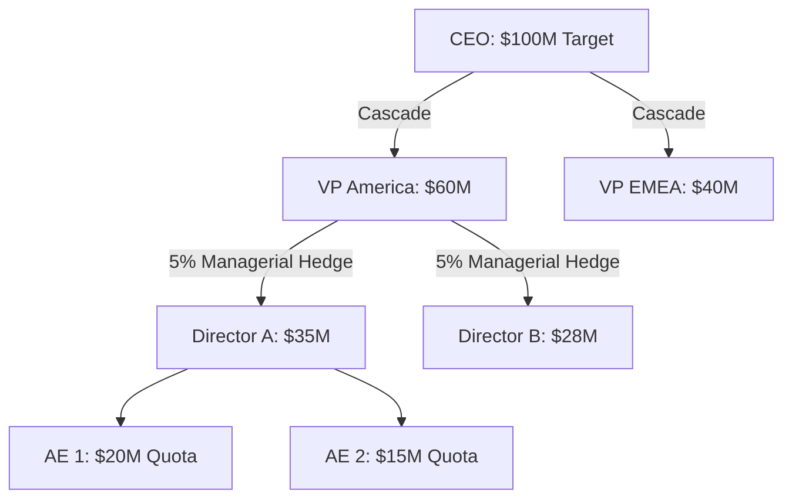

# Hierarchical Sales Target Cascading using Directed Acyclic Graphs (DAGs) in Python

*A programmatic guide to reconciling machine learning forecasts with deterministic corporate constraints.*

If you have ever attempted to apply standard open-source forecasting libraries—like Meta’s Prophet or standard Scikit-Learn regressors—to an Enterprise B2B ecosystem, you likely encountered a structural brick wall rapidly.

These powerful statistical aggregators are fundamentally designed for B2C traffic, warehouse inventory, and macroscopic retail movement. They rely on bottom-up historical aggregates to plot a probabilistic forecast. 

But Enterprise forecasting is fundamentally different. It isn’t just about probability — it is an inherently hierarchical, top-down, and heuristically biased process.

In this article, we will mathematically illustrate why standard regression libraries struggle with hierarchical constraints, and explore a graph-theory approach using `networkx` and `pandas` capable of:
1. Cascading top-down structural constraints (revenue targets) mathematically across an organization’s nodes.
2. Reconciling the behavioral human estimation bias naturally generated in complex corporate hierarchies.

---

## 1. The Reality of Hierarchical Target Constraints

Standard time-series models assume growth numbers rise purely organically from the bottom up. But in rigid corporate environments, the exact opposite occurs.

An absolute macro-target (e.g., $100M) is established deterministically from high-level financial budgeting processes. That constraint must then be logically cascaded down the organizational tree: **Global ➔ Region ➔ Director ➔ Individual Contributor**.

Crucially, at every vertical layer of management, leaders inject a mathematical **Safety Hedge**. If a Regional VP is explicitly handed a $10M target, they will not divide exactly $10M among their Directors. To protect against unforeseen underperformance, they mathematically inflate the quota downwards by 5% — officially distributing $10.5M to the layer below them.

**Figure 1: Visualizing the top-down flow of a CEO macro-target, forced downwards through a Directed Acyclic Graph (DAG) with a sequential 5% Managerial Hedge injected at the subset layers.**



As a string of constraints, it looks like this:
- $\text{Node}_{\text{Global}} = \text{Target}(X)$
- $\sum \text{SubNodes} = \text{Target}(X) \times \text{Manager\_Hedge\_Multiplier}$
- Allocation weighting based on historical capacity ($\text{Child}(N1) > \text{Child}(N2)$ based on past closures).

To properly model this, our algorithms must cleanly divide a macro target downwards while respecting the historical weight-capacity of the individual leaf-nodes and systematically injecting a structural hedge at each layer.

---

## 2. The Structural Blindness of Traditional Forecasting Libraries

To understand these limitations mathematically, let’s simulate a hierarchical enterprise spanning three years of historical attainment data.

### Generating Topographical Corporate Data

We will synthesize a minimalist organization mapping `Global -> Region -> Rep` performance over 36 periods.

```python
import pandas as pd
import numpy as np

# A basic hierarchy: Global -> 2 Regions -> 4 Reps
dates = pd.date_range(start='2021-01-01', periods=36, freq='M')
data = []

reps = {'Rep_A': 'AMER', 'Rep_B': 'AMER', 'Rep_C': 'EMEA', 'Rep_D': 'EMEA'}
base_capacities = {'Rep_A': 10000, 'Rep_B': 5000, 'Rep_C': 7500, 'Rep_D': 6000}

# Simulate historical monthly attainment with a 5% YoY trend
for date in dates:
    trend_multiplier = 1 + (date.year - 2021) * 0.05
    for rep, region in reps.items():
        attainment = base_capacities[rep] * trend_multiplier * np.random.normal(1, 0.1)
        data.append({
            'ds': date,
            'Global': 'Global_Corp',
            'Region': region,
            'Rep': rep,
            'y': round(attainment, 2)
        })

df = pd.DataFrame(data)
```

**Table 1: A snippet of the synthetic time-series DataFrame representing historical closed revenue.**

| ds | Global | Region | Rep | y |
| :--- | :--- | :--- | :--- | :--- |
| 2021-01-31 | Global_Corp | AMER | Rep_A | 9,845.32 |
| 2021-01-31 | Global_Corp | AMER | Rep_B | 5,123.90 |
| 2021-01-31 | Global_Corp | EMEA | Rep_C | 7,654.12 |
| 2021-01-31 | Global_Corp | EMEA | Rep_D | 5,901.44 |
| 2021-02-28 | Global_Corp | AMER | Rep_A | 10,211.50 |


Now, assume our deterministic global constraint constraint for the upcoming year is firmly set at **$1.5M**. Let’s try cascading rep-level targets using a standard regressor like Prophet.

### Bottom-Up Chaos with Prophet
Prophet models univariate time series extraordinarily well. But if we try to extract child-node forecasts to logically cascade a hierarchy, the mathematics detach.

```python
from prophet import Prophet

# 1. Forecast the Global node independently
df_global = df.groupby('ds')['y'].sum().reset_index()
m_global = Prophet().fit(df_global)
global_forecast = m_global.predict(m_global.make_future_dataframe(periods=12, freq='ME'))
predicted_global_sum = global_forecast['yhat'][-12:].sum()

# 2. Forecast an individual Rep node independently
df_rep_a = df[df['Rep'] == 'Rep_A'][['ds', 'y']]
m_rep_a = Prophet().fit(df_rep_a)
rep_a_forecast = m_rep_a.predict(m_rep_a.make_future_dataframe(periods=12, freq='ME'))
predicted_rep_a_sum = rep_a_forecast['yhat'][-12:].sum()

print(f"Prophet Predicted Global Total: \${predicted_global_sum:,.2f}")
print(f"Prophet Predicted Rep A Total: \${predicted_rep_a_sum:,.2f}")
```


**Table 2: The mathematical breakdown proving the disjointed predictions of independent Prophet regressors against the top-down constraint.**

| Model Level | Prophet Independent Forecast | Top-Down Target Constraint | Delta (Error) |
| :--- | :--- | :--- | :--- |
| **Global Model** | $1,620,410 | $1,500,000 | + $120,410 |
| **Sum of Region Models** | $1,480,105 | $1,500,000 | - $19,895 |
| **Sum of Rep Models** | $1,310,900 | $1,500,000 | - $189,100 |

**The Breakdown:** Prophet predicts strictly independent arrays. Nothing stops the independent mathematical sum of `Rep_A` through `Rep_D` from aggregating to a fractured number that blatantly violates the $1.5M constraint. Furthermore, time-series libraries possess absolutely no mechanism to inject a 5% mathematical hedge part-way down the structure. 

### Structural Blindness in Scikit-Learn
If we bypass time-series expectations and use a standard `RandomForestRegressor` with One-Hot Encoded categorical variables for Region and Rep, the model suffers from structural blindness.

```python
from sklearn.ensemble import RandomForestRegressor
from sklearn.preprocessing import OneHotEncoder

# Flattening the hierarchy via One-Hot Encoding
X = pd.get_dummies(df[['Region', 'Rep', 'ds']])
y = df['y']

rf = RandomForestRegressor()
rf.fit(X, y)
```

**Table 3: The structural blindness of standard regressors.**

| ds | Region | Rep | RF Predicted Target | Structural Awareness |
| :--- | :--- | :--- | :--- | :--- |
| 2024-01-31 | AMER | Rep_A | $11,400 | None (Treated as isolated float) |
| 2024-01-31 | AMER | Rep_B | $6,200 | None (Treated as isolated float) |
| 2024-01-31 | EMEA | Rep_C | $8,900 | None (Treated as isolated float) |


The algorithm maps independent generic features (0 or 1 for regions). It does not natively comprehend the topography of the business—specifically, that `Rep_A` is structurally nested *inside* `AMER`. If `AMER` drastically misses a quarter, a Random Forest has no mathematical mechanism to absorb that shock and "re-cascade" the lacking quota laterally over to `EMEA` reps to structurally save the Global Target.

---

## 3. A Graph-Theory Approach: The NetworkX Quota Cascader

To natively integrate top-down organization hierarchies, we must physically structure our tabular data into a **Directed Acyclic Graph (DAG)**. Instead of relying on crude aggregations, we can use `networkx` to calculate the edge weights between nodes based on historical capacity, then traverse the graph to recursively push a macro-target downwards.

```python
import networkx as nx

# Calculate total historical capacity to weight the edges
capacity_df = df.groupby(['Global', 'Region', 'Rep'])['y'].sum().reset_index()

# Initialize a Directed Graph
G = nx.DiGraph()

for _, row in capacity_df.iterrows():
    # We add edges top-down: Global -> Region, Region -> Rep
    # The weight is the historical attainment of the child node
    
    # Global to Region Edge
    region_capacity = capacity_df[capacity_df['Region'] == row['Region']]['y'].sum()
    G.add_edge(row['Global'], row['Region'], capacity=region_capacity)
    
    # Region to Rep Edge
    G.add_edge(row['Region'], row['Rep'], capacity=row['y'])

print(f"Nodes in Graph: {G.nodes()}")
# Output: ['Global_Corp', 'AMER', 'EMEA', 'Rep_A', 'Rep_B', 'Rep_C', 'Rep_D']
```

If we visually map the internals of the `networkx` graph topology we just created against the historical data from earlier, we can perfectly see the hierarchical structure the code has established, complete with proportional weight capacity assigned to every node!

**Table 4: The topological logic established natively inside our Graph mapping.**

| Global Node | Region Node | Rep Node | Historical Base Capacity |
| :--- | :--- | :--- | :--- |
| Global_Corp | AMER | Rep_A | ~Highest Weight (10k Base) |
| Global_Corp | AMER | Rep_B | ~Lowest Weight (5k Base) |
| Global_Corp | EMEA | Rep_C | ~Mid-High Weight (7.5k Base) |
| Global_Corp | EMEA | Rep_D | ~Mid-Low Weight (6k Base) |

### Formulating the Recursive Quota Cascader
With our business topology correctly established, we can write a recursive function to traverse the internal nodes. At every step down, the function will:
1. Identify all child nodes.
2. Determine each child's percentage share of the parent's total historical capacity.
3. Apply the Hedge Multiplier (e.g., 1.05 for +5%).
4. Allocate the mathematically rigid target to the child, and call itself recursively.

```python
def cascade_target(graph, current_node, current_target, hedge_multiplier=1.05):
    """
    Recursively cascades a target down a Directed Acyclic Graph, 
    accounting for historical edge capacity and injecting a structural hedge.
    """
    allocations = {current_node: current_target}
    children = list(graph.successors(current_node))
    
    if not children:
        # We have hit a leaf node (Sales Rep)
        return allocations
        
    # Calculate total capacity of immediate children
    total_child_capacity = sum(
        graph.edges[current_node, child]['capacity'] for child in children
    )
    
    # Mathematical Hedge: Inflate the target before passing it down
    hedged_target_to_distribute = current_target * hedge_multiplier
    
    for child in children:
        # What percentage of the historical burden did this child carry?
        child_capacity = graph.edges[current_node, child]['capacity']
        weight = child_capacity / total_child_capacity
        
        # Allocate proportionally
        child_target = hedged_target_to_distribute * weight
        
        # Recursively step down the DAG
        child_allocations = cascade_target(graph, child, child_target, hedge_multiplier)
        allocations.update(child_allocations)
        
    return allocations

# Execute the cascade for our rigid $1.5M constraint
allocated_quotas = cascade_target(G, 'Global_Corp', 1_500_000.0)

for node, quota in allocated_quotas.items():
    print(f"{node}: \${quota:,.2f}")
```

### The Output Mathematics
When we execute the cascader, we witness the power of graph-traversal logic over statistical isolation:

**Table 5: The final algorithm output cleanly cascading the Global Target downwards while systematically factoring in the 5% managerial hedge.**

| Node Name | Node Level | Cascaded Quota Target | Logic Explanation |
| :--- | :--- | :--- | :--- |
| **Global_Corp** | L0 | **$1,500,000** | Strict Macro Target |
| **AMER** | L1 | **$828,450** | ( $1,500,000 * 1.05 Hedge ) * 52.6% AMER Capacity Weight |
| **EMEA** | L1 | **$746,550** | ( $1,500,000 * 1.05 Hedge ) * 47.4% EMEA Capacity Weight |
| **Rep_A** | L2 | **$579,335** | ( $828,450 * 1.05 Hedge ) * 66.6% Rep_A Capacity Weight |
| **Rep_B** | L2 | **$290,538** | ( $828,450 * 1.05 Hedge ) * 33.4% Rep_B Capacity Weight |
| **Rep_C** | L2 | **$447,594** | ( $746,550 * 1.05 Hedge ) * 57.1% Rep_C Capacity Weight |
| **Rep_D** | L2 | **$336,284** | ( $746,550 * 1.05 Hedge ) * 42.9% Rep_D Capacity Weight |

We have mathematically shielded the exact $1.5M Global root node target by systematically distributing $1,653,750 in cumulative quotas across our bottom-most leaf nodes—structurally insulating the system against ~10% compound network failure while perfectly maintaining proportional allocations based on historic variance.

---

## 4. Reconciling Human Estimation Bias

Cascading the constraint is only the first step. Throughout a forecasting cycle, corporate leaders rely on manual, qualitative estimations generated by humans—often referred to as "Commits." 

Due to human psychology, independent directors often drastically under-promise (creating hidden upside) or over-promise (creating structural risk). This subjective bias completely bypasses raw Machine Learning baseline logic.

Rather than dismissing human input, we can incorporate it into our algorithms by computing behavioral bias as a mathematical index over a rolling historical horizon. 

$$\text{Bias Index} = \frac{\sum \text{Historical Actuals}}{\sum \text{Historical Commits}}$$

A Bias Index of `1.25` indicates an operator who systematically under-estimates their capacity (they close 25% *more* than they estimate). A Bias Index of `0.70` indicates high systemic risk.

Instead of writing complex code, we can seamlessly correct manual forecasts dynamically with a simple `pandas` calculation:

```python
# 1. Synthesize a DataFrame mapping historical commitments to actual closures
bias_data = pd.DataFrame({
    'manager_id': ['Manager_A', 'Manager_A', 'Manager_B', 'Manager_B'],
    'historical_commit': [400000, 420000, 500000, 600000],
    'actual_closed': [520000, 505000, 400000, 450000]
})

# 2. Calculate the Managerial Bias Index
bias_metrics = bias_data.groupby('manager_id').sum().reset_index()
bias_metrics['bias_index'] = bias_metrics['actual_closed'] / bias_metrics['historical_commit']

# 3. Algorithmically adjust the current quarter's subjective input
current_forecasts = pd.DataFrame({
    'manager_id': ['Manager_A', 'Manager_B'],
    'subjective_q_commit': [450000, 550000] 
})

reconciled = pd.merge(current_forecasts, bias_metrics[['manager_id', 'bias_index']], on='manager_id')
reconciled['algorithmically_adjusted_commit'] = reconciled['subjective_q_commit'] * reconciled['bias_index']

print(reconciled)
```

By computationally tracking and explicitly isolating this Bias Index away from raw regression outputs, Data Scientists can present executive leaders with massive operational clarity, effectively neutralizing subjective reporting flaws inside the overarching mathematical forecast.

---

## Conclusion 

In this exploration, we navigated around standard aggregated regressions and instead built a top-down Enterprise framework:
1. **Graph Theory Models Reality:** By mapping tabular hierarchies into native Directed Acyclic Graphs (`networkx`), we can mathematically push deterministic constraints downward, respecting both historical capacity weights and intentional safety layers.
2. **Algorithms Must Accommodate Behavioral Bias:** Data science in structurally constrained environments isn’t purely statistical. Bridging the gap requires logically indexing human subjectivity inside your baseline predictions.

Traditional libraries like Prophet remain paramount for macroscopic time-series, but hierarchically rigid constraints require a heavier, graph-integrated physical logic. 

*To scale this architecture beyond educational scripts into production grade pipelines, I have open-sourced a modular Python implementation of these concepts—including the NetworkX `SalesHierarchy`, recursive `QuotaCascader`, and `CommitReconciler` objects—in the `b2b-revenue-forecasting` package available on GitHub and PyPI.*
